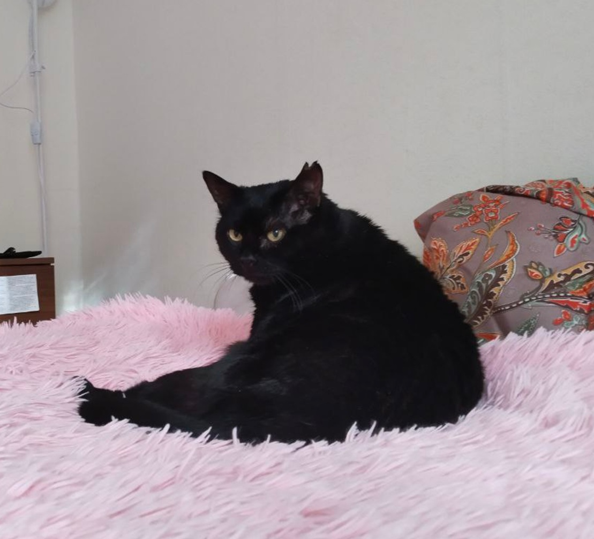

###### Мой путь в ИТ

Привет, я Лейсан, мне 34. 
 

Пять лет назад я уволилась из итальянского визового центра, в коол-центре которого проработала 5 лет. Мне хотелось поменять свою рабочую деятельность на более прикладную, техническую, не зависеть от дресс-кода и офиса, и не нужной бюрократии.  
<u>Технологии</u> – это то, что мне всегда было интересно, но не хватало времени, усидчивости, мотивации, веры в себя и свои способности. 

#### Я долго думала с чего начать? 
И начала с курсов по аналитике баз данных, это было не просто, но я получила долгожданный диплом. С работой в аналитике не задалось, однако благодаря этому диплому и приобретённым навыкам я прошла собеседование в техподдержку, где и тружусь 2 год. 

### Почему же тестирование QA? 
 Признаюсь честно, я не шла к этой профессии всю жизнь, но этому поспособствовало: 
1.	Курс по информационной безопасности (который был приобретен изначально) показался мне скучным. Пересиливать себя я не стала. 
2.	Рабочие кейсы часто затрагивают отдел тестирования и мне было интересно примерить на себя эту профессию. И еще больше понимания пришло со знанием терминов и их значений. 
3. _Волшебство и чудо_ , которое совершается, когда открываешь терминал или панель разработчика. 

GitHub довольно сложный продукт, но ..
>  дорогу осилит идущий... 
 

_Фото моего котика, который вдохновляет меня на подвиги._

И любимый рабочий мем)

